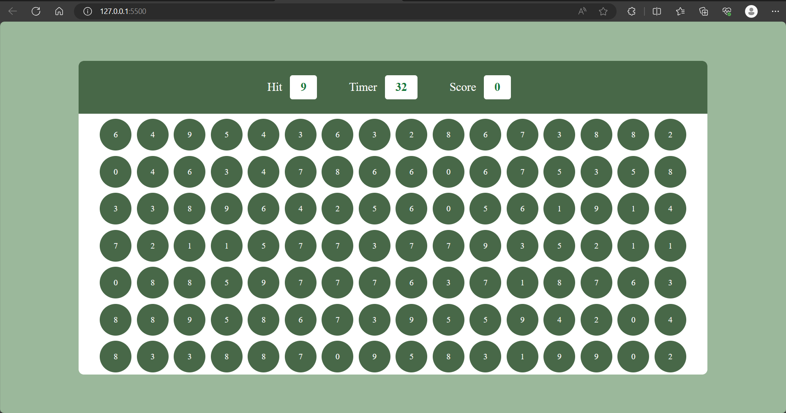

# Bubble Game

This is a simple JavaScript-based bubble popping game with a timer. The goal of the game is to click on bubbles with the correct number to earn points before the timer runs out.

## Table of Contents

- [Demo](#demo)
- [Features](#features)
- [Installation](#installation)
- [Usage](#usage)
- [How to Play](#how-to-play)
- [Contributing](#contributing)

## Demo

You can play the game live at [Game Demo](https://your-game-demo-url.com).

## Features

- Click on bubbles with the correct number to earn points.
- A timer counts down, and the game ends when the timer reaches 0.
- Option to play again after the game over.

## Installation

1. Clone the repository or download the source code.
2. Open the `index.html` file in your web browser.

## Usage

Simply open the `index.html` file in your web browser, and the game will start. Click on the bubbles with the correct number to earn points. The game ends when the timer reaches 0.

## How to Play

- Click on bubbles with the number displayed in the "Hit" box to earn points.
- The timer counts down from the initial value.
- Try to earn as many points as possible before the timer runs out.
- When the game ends, you can click the "Play Again" button to start a new game.

## Contributing

Contributions are welcome! If you have any suggestions, bug reports, or feature requests, please open an issue or create a pull request.
